# Project 1 
## Jacob Kleiman & Jesus Quezada
### SEI 08

Title: Jamr 
Type: Project 
Team: Jacob Kleiman & Jesus Quezada  
Back-end Frameworks: Express / Node JS  
Front-end Frameworks: Bootstrap / Semantic UI 
Requirements: Full CRUD on at least one database model  
Goal: Allow local musicians to connect instantly in their geographical location.  
Goals reached: Dynamic map display, filters and group chat  

# Jamr
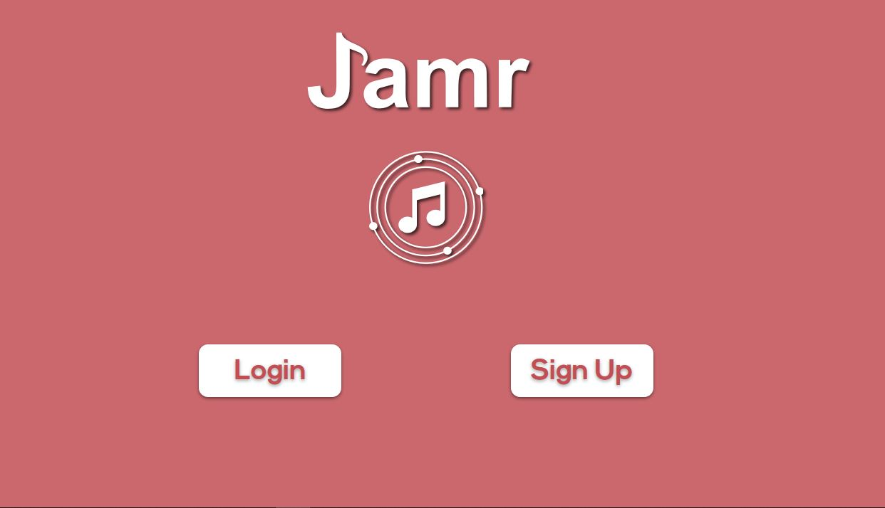

## Planning
Over the intial days of the project, We drafted ERD Diagrams, and conceptualized the entire back-end of our database. We aimed to acheieve full crud on the profiles as the MVP of our project.

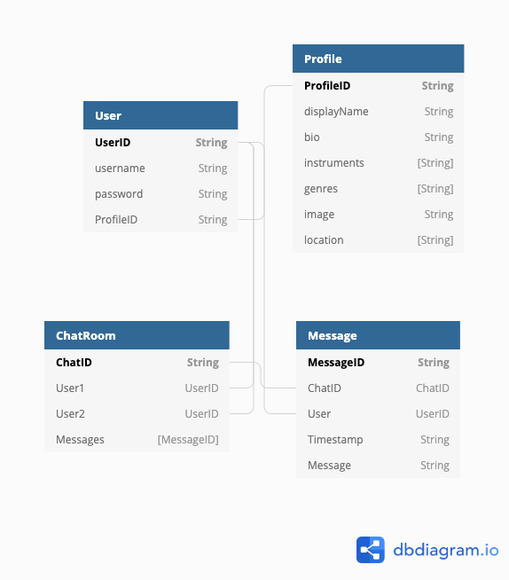

## The basic idea

When launching the app, the user will be prompted to CREATE (register) or READ (login) to their account. From there they can UPDATE or DESTROY their profile and make them unique and customizable. Users will be able to explore and INDEX (find) fellow musicians to collaborate with.

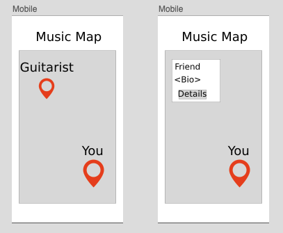

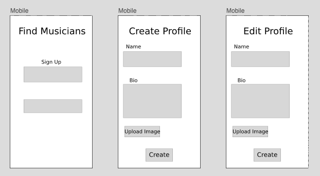

## Google Maps and Filtering Markers

To tailor the map to the user's search preferences, we figured that the user should be able to filter the map based on Instruments, Genres, or Distance... we went ahead and built a function to filter out all falsey users of the filtering conditions.

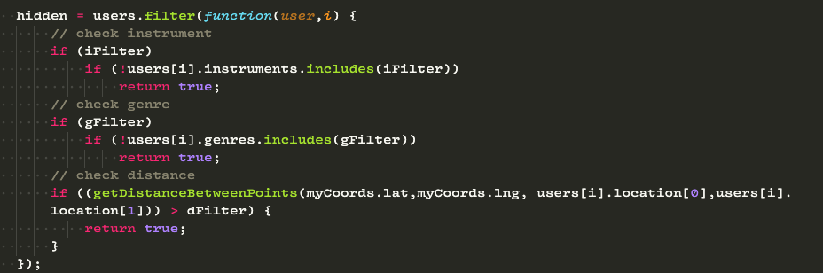

The way to calculate the distance between two geographical coordinates was challenging at first, but very rewarding in the final product.

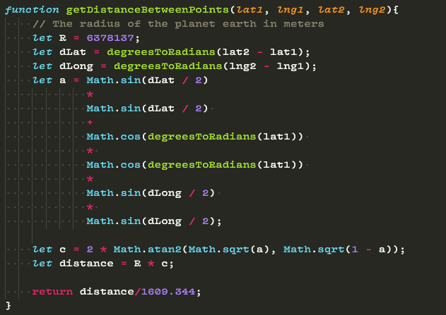

##  Realtime, bi-directional communication with Socket.io

In order to achieve our chat feature we leveraged the popular 
JavaScript Socket.io library. This allowed us to have seamless 
event-driven data on the server and cilent side. 

Server Side

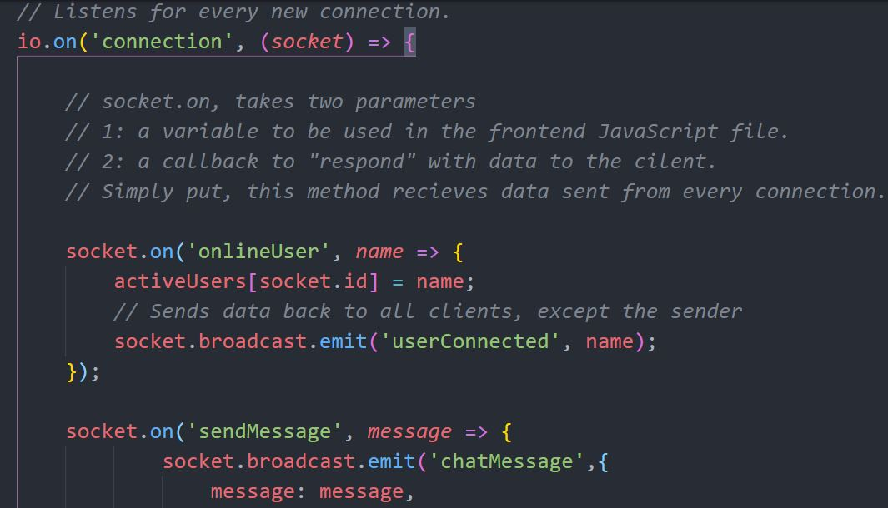

Client Side

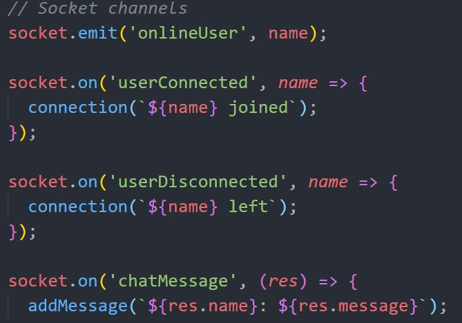

## The UI and Branding

The creative direction of the application ui stemmed from two separate ideas encapsulated in these mood boards.

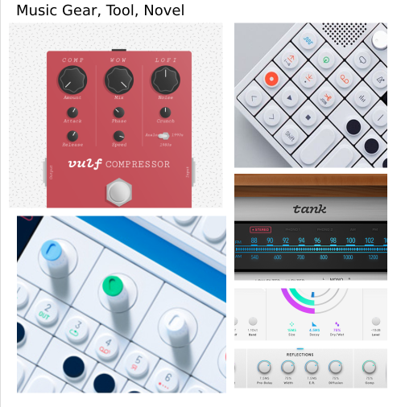
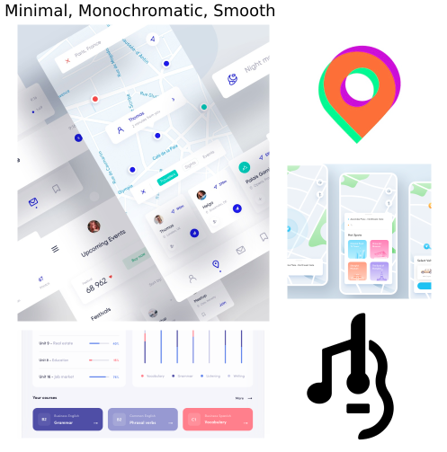

The final product was an integrated version of the two ideas. Minimal, triadic, and tool-like.

## The Typefaces and Design Assets

The type logo was created with a modified musical take on the Helvetica typeface. Subheadings and paragraphs included Vice City Sans (which adds a depth of playfulness) as well as Raleway, which provided thin, minimal style to our app.

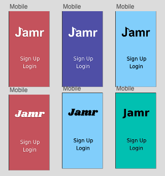

A concept logo was also created to brand the application as a tool for finding musicicans

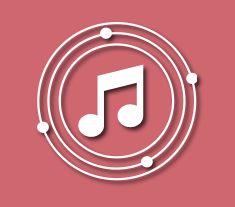

## Mid/Hi-fi Wireframes

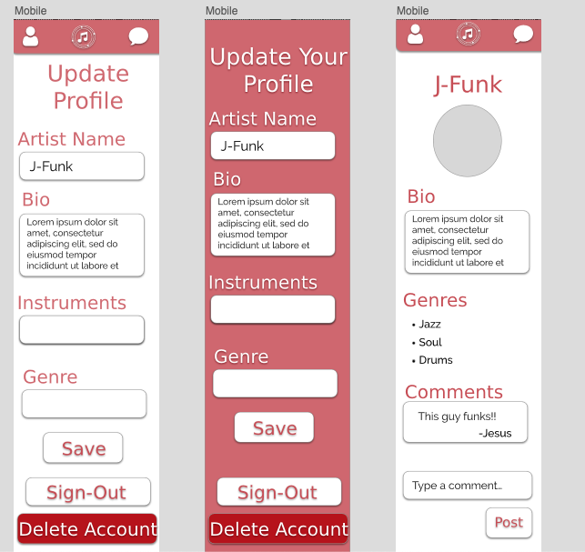

## Interaction Design

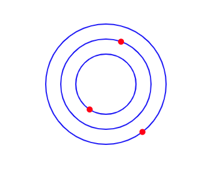

https://codepen.io/kleimaj/pen/dyoRyPK

## Full Implementation

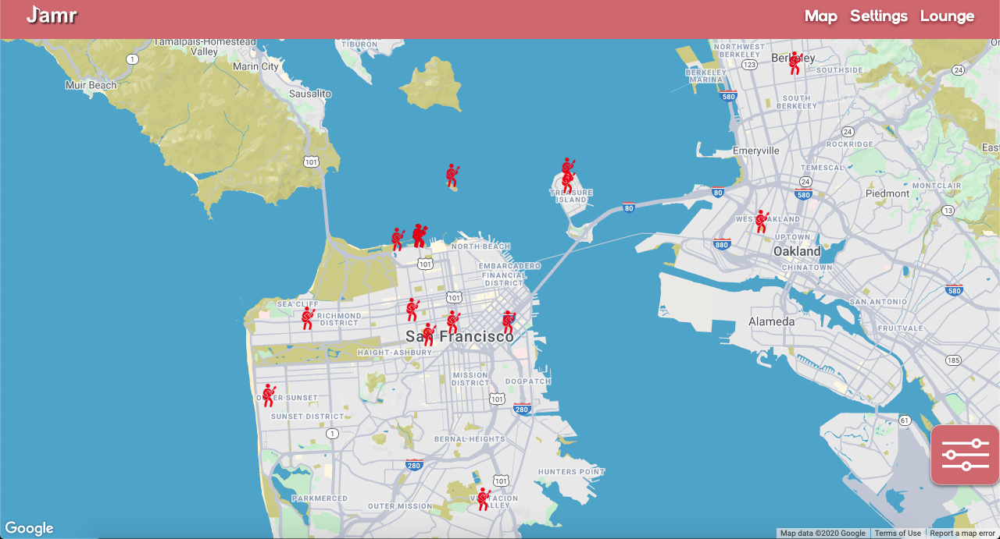
